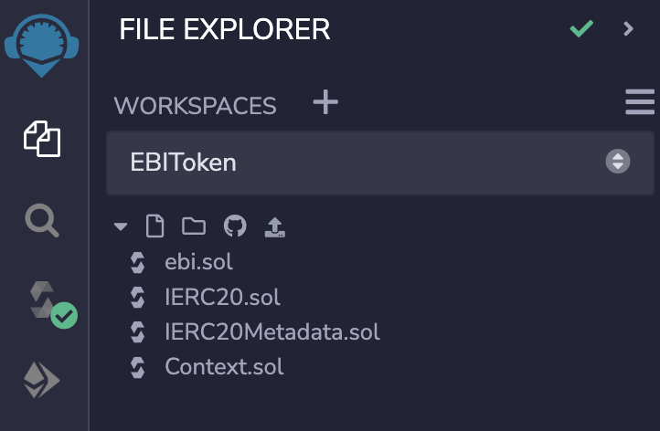

# solidity-ebi
an ERC20 compatible token for coffee shop

### Remix IDE:

To compile and test the code, you need to download and install Remix IDE, or use the web version.

You can access the web version Remix IDE here: https://remix.ethereum.org/

or download the desktop version here: https://github.com/ethereum/remix-desktop/releases

For how to use the Remix IDE to compile, test and deploy the code, please refer to the official documentation: https://remix-ide.readthedocs.io/en/latest/

### Compile the smart contract:

To compile the EBI Token code, first you need to create a file in the Remix IDE and copy the code there.

You can do this in the Remix IDE File Explorer.

Then you can go to Compiler and compile the code using the latest version of Compiler.

### Deploy and test the smart contract locally:

To test the smart contract locally, you can deploy it to the Remix VM. Normally we will select Remix VM (London) for the test VM, and select one of the account from the list. The account you choose will become the contract owner after deploy. Additionally, the smart contract will need 4 parameters:

name_: The name of the token. (Our own contract uses "Ebi Token")

symbol_: The symbol of the token. (Our own contract uses "EBI")

handingRateNum: The tax percentage. (Our own contract uses 12, this can be changed later by calling "setHandlingRate" function)

tipRateNum: The tips percentage. (Our own contract uses 15, this can be changed later by calling "setTipRate" function)

After deployment, you will be able to test all the functions in the generated contract at the bottom. To test the function, just put the required parameters,  and click the function name. Note that the account you choose earlier will be the one who actually call the function. Remember to change account to another one in order to test all functions.

More specifically, function names showing in blue are read only functions, function names showing in orange are functions that will write or update data to the smart contract, and function names showing in red is payable functions, and you will need to specify the amount of Ether to pay when calling these functions.

To know more about each function's usage, please check the remark inside the code file.

### Deploy the smart contract to the test network or main network:

To deploy the smart contract to the test network or main network, first you have to prepare for a wallet and get some Ether.

#### Prepare Metamask:

Metamask is one of the most popular software wallet to let you interact with Ethereum test and main network. To get the Metamask, you can go to https://metamask.io/ for more information.

After installing Metamask to your browser, you will have to create an account. Please follow the steps inside the Metamask to create one, and you will get an Ethereum address as your account.

#### Get some Ether for contract deployment:

The smart contract deployment is also a transaction and will cost a lot of gas. The actual deployment for our smart contract will cost around 3.5M gas, which is around 0.05Ether (at ~20 gwei gas fee) if you want to deploy it to the Main network.

For the Goerli test network, you can get the test Ether from one of the Faucets listed in here: https://faucetlink.to/goerli

#### Deploy to the test network:

After you have done the preparation, you can go to Remix IDE, and in the Deploy page, select "Injected Provider - MetaMask" as your envionment. The MetaMask may pop up and ask you to sign to confirm the connection. Make sure you have selected the right network, and select the correct account to deploy the contract.

Then if everything is good you can click "Deploy" to proceed. MetaMask will pop up again and ask you to confirm the transaction. Double check all the information and click "Confirm" to confirm the transaction.

Then after a while you should see your contract to be deployed. For the Goerli test network, you can check your account and contract status here: https://goerli.etherscan.io/, and for the Main network, you can check the information here: https://etherscan.io/
